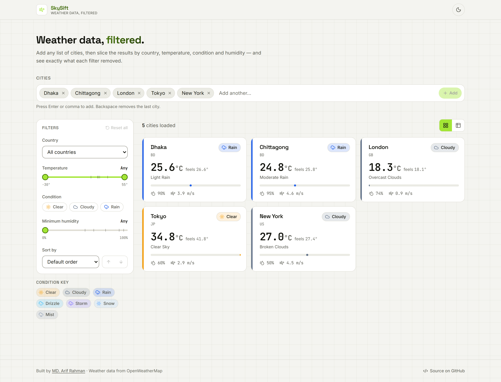
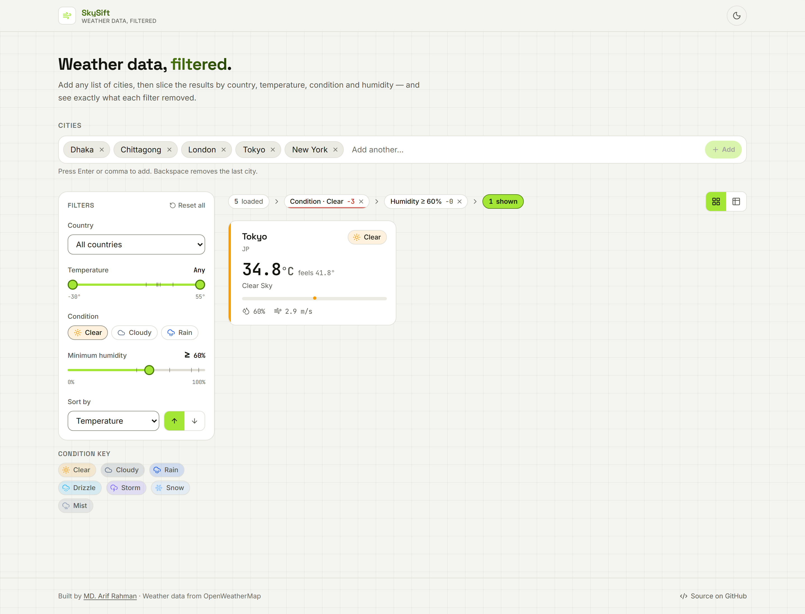
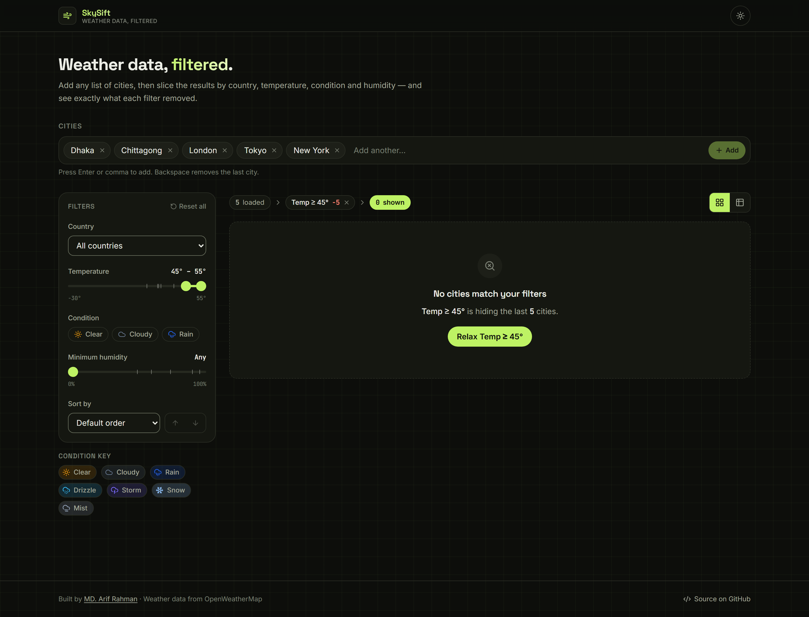
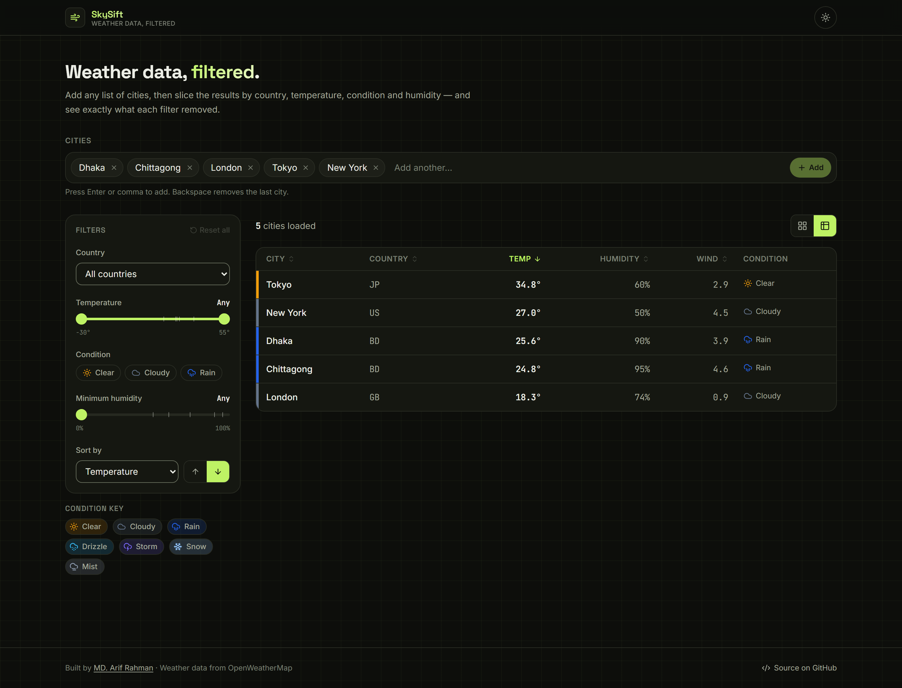
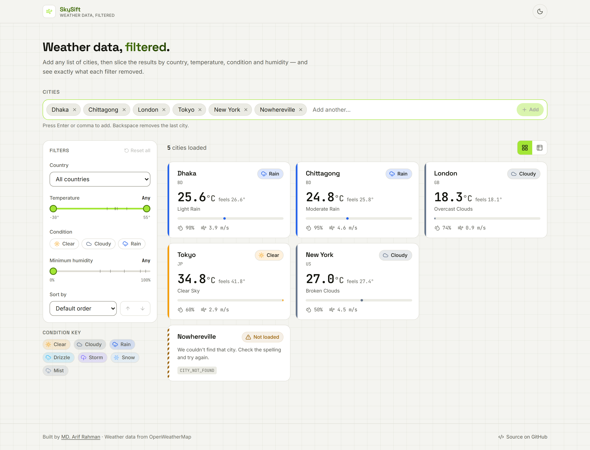
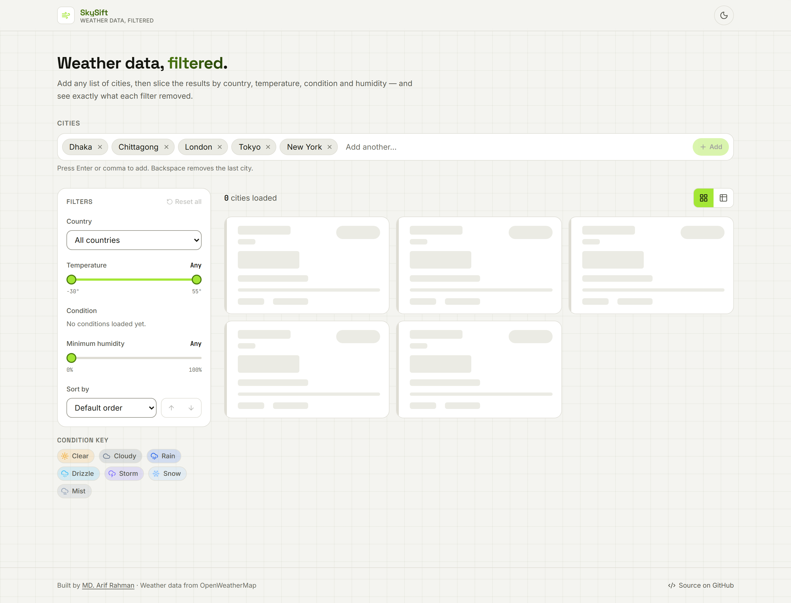
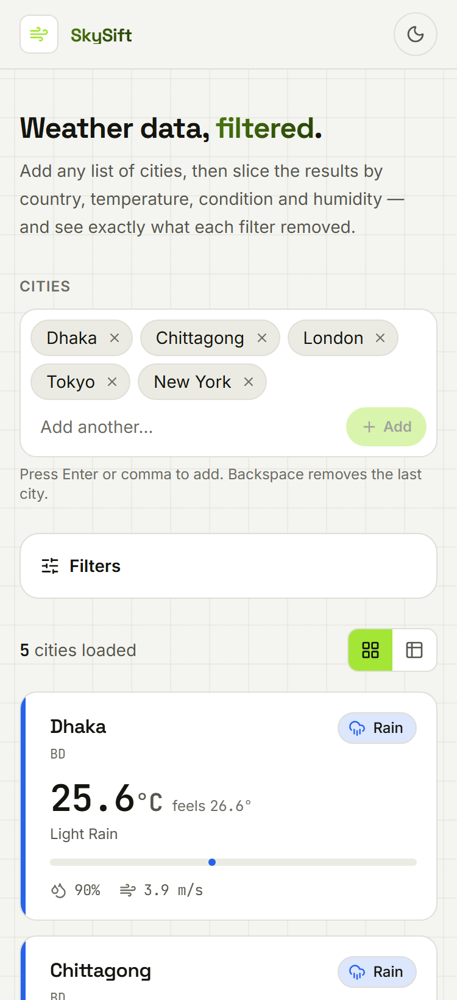
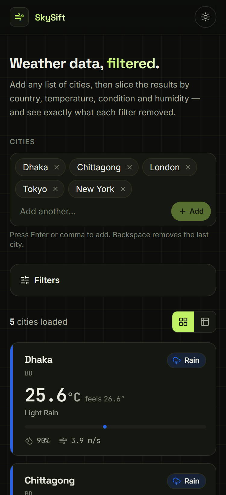

<div align="center">

# SkySift

**Sift the sky.** A weather data service with a filtering instrument on top.

Fetch current weather for any list of cities, then slice it by country,
temperature, condition and humidity — and see **exactly what each filter removed.**

[**▶ Live demo**](https://skysift-five.vercel.app) · [Screenshots](#screenshots) · [API](#the-api)

[](https://github.com/Arif26761/skysift/actions/workflows/ci.yml)


</div>



---

## The idea

The brief's most important sentence isn't a requirement:

> _"We're not looking for a pixel-perfect Figma-to-code clone — we're looking for
> whether you can turn a data shape into something a non-technical user could
> actually operate."_

So this isn't a weather app. **It's a filtering instrument that happens to
contain weather.**

Every filter UI shares one blind spot: you narrow the data, rows vanish, and
nothing tells you _which control_ removed them. Users respond by resetting things
at random.

### The Filter Funnel

The reduction is drawn as a pipeline. Each stage names a filter, reports how many
cities it is hiding, and **is itself the button that clears it** — so the
explanation and the fix are the same object:



```
5 loaded  ›  Temp ≥ 5° −0  ›  Condition · Clear −3  ›  Humidity ≥ 60% −0  ›  1 shown
```

A stage reading `−0` is doing nothing on its own — itself useful, because it tells
you not to bother touching that one.

It is deliberately **not** drawn as a tapering funnel shape. `excluded` is a
_marginal_ contribution — how many records return if that one filter is relaxed
with the others left in place — so when two filters reject the same city, neither
gets credit and the stages **do not sum** to `loaded − shown`. Segments each
shaving a proportional slice off a narrowing bar would draw sequential
subtraction over numbers that aren't sequential, and the widths would not
reconcile with the endpoints. Each stage instead carries a hairline _blame bar_
scaled against the largest exclusion in the current set — a true statement about
marginal contributions — and the endpoints stay exact numbers, never inferred
from a width.

When results hit zero, the empty state **names the cause** instead of shrugging:



The numbers come from a leave-one-out sensitivity analysis: run
`filterWeatherData` once with everything applied, then once more per filter with
that one omitted. **This is only affordable because the filter function is pure**
— six passes over a small array, no I/O, no chance of the calls interfering. The
architectural discipline Part 2 asked for unlocked a feature the brief never
requested.

### The design language

The interface chrome is **chartreuse**, and that's a functional constraint rather
than a taste call. The condition language already owns the entire cold-blue
family plus amber (Rain blue, Drizzle sky, Snow pale ice, Clear amber, Storm
violet). If chrome sat in any of those, a chip would be genuinely ambiguous —
_filter control, or precipitation?_ Chartreuse is the one hue those semantics
leave unclaimed, so chrome and data can never be confused.

It comes with a real constraint, handled rather than ignored: chartreuse measures
about **1.5:1 on a light ground**, so it cannot legally carry text there. It is a
_fill_ colour, always with near-black on top; where the brand hue must actually
_be_ text, a darkened `--primary-text` is used instead. A third token,
`--primary-edge`, draws a 1px border around chartreuse fills — a filled control's
label can be perfectly legible while its **edge** is invisible, and WCAG 1.4.11
asks for 3:1 on a component's boundary, not just its text.

---

## What the assessment asked for

| Requirement                                                   | Where                                                                                                                              |
| ------------------------------------------------------------- | ---------------------------------------------------------------------------------------------------------------------------------- |
| **Part 1** — fetch current weather for a list of cities       | [`fetch-weather.ts`](./src/lib/weather/fetch-weather.ts), [`provider/openweather.ts`](./src/lib/weather/provider/openweather.ts)   |
| Typed records: city, country, temp, humidity, condition, wind | [`types.ts`](./src/lib/weather/types.ts)                                                                                           |
| **Part 2** — `filterWeatherData(data, filters)`, combined     | [`filter.ts`](./src/lib/weather/filter.ts)                                                                                         |
| **Part 3** — graceful failures, no raw exceptions             | [`errors.ts`](./src/lib/weather/errors.ts), [`fetch-weather.ts`](./src/lib/weather/fetch-weather.ts)                               |
| One bad city must not crash the batch                         | `Promise.allSettled` + per-call `try/catch` + orchestrator-owned deadline                                                          |
| **Part 4** — city chip input                                  | [`city-input.tsx`](./src/components/weather/city-input.tsx)                                                                        |
| Filter panel — a control for **every** Part 2 filter          | [`filter-panel.tsx`](./src/components/weather/filter-panel.tsx)                                                                    |
| Results, updating live as filters change                      | [`weather-card.tsx`](./src/components/weather/weather-card.tsx), [`weather-table.tsx`](./src/components/weather/weather-table.tsx) |
| Loading / empty / inline error states                         | [`states.tsx`](./src/components/weather/states.tsx)                                                                                |
| Responsive at ~375px → desktop                                | [screenshots below](#screenshots)                                                                                                  |
| Consistent visual language for conditions                     | [`conditions.ts`](./src/lib/weather/conditions.ts)                                                                                 |
| A few unit tests                                              | **123 tests**, 9 files                                                                                                             |
| README with setup + screenshots                               | this file                                                                                                                          |
| Live demo _(optional plus)_                                   | [skysift-five.vercel.app](https://skysift-five.vercel.app)                                                                         |

---

## Quick start

```bash
git clone https://github.com/Arif26761/skysift.git
cd skysift
npm install
npm run dev
```

Open <http://localhost:3000>. **No API key required** — see below.

### API key (optional)

SkySift runs without one. With no key configured it starts in **Demo Mode**,
serving realistic fixture data behind a clearly-labelled banner. For live data:

```bash
cp .env.example .env.local
```

```ini
# .env.local
OPENWEATHER_API_KEY=your_key_here
```

Get a free key at [openweathermap.org](https://home.openweathermap.org/api_keys),
then restart the dev server.

> **Note:** a brand-new OpenWeatherMap key takes 10 minutes – 2 hours to
> activate, returning `401` until then. SkySift surfaces that as a typed
> `INVALID_API_KEY` error with copy that explains the delay, rather than a crash.

The variable is **not** prefixed `NEXT_PUBLIC_`, and is read only inside
[`provider/index.ts`](./src/lib/weather/provider/index.ts), which imports
`server-only` — so importing it from a client component is a _build error_, not a
code-review catch. This is the main reason the project uses a Next.js Route
Handler rather than calling OpenWeatherMap from React.

_Verified on the live deployment: the key appears in none of the 9 client JS
chunks, nor in the served HTML._

---

## The API

The service is usable on its own, without the UI.

```bash
# Basic fetch
curl "http://localhost:3000/api/weather?cities=Dhaka,Chittagong,London,Tokyo,New%20York"

# The assessment's example filter call
curl "http://localhost:3000/api/weather?cities=Dhaka,Chittagong,Cairo&country=BD&minTemp=25&condition=Clear&sortBy=temperature&order=desc"

# All filters combined
curl "http://localhost:3000/api/weather?cities=Dhaka,London,Tokyo,Reykjavik&minTemp=10&maxTemp=30&minHumidity=60&sortBy=humidity&order=desc"

# POST, for long lists or names containing commas
curl -X POST http://localhost:3000/api/weather \
  -H 'Content-Type: application/json' \
  -d '{"cities":["Washington, D.C.","Dhaka"],"filters":{"sortBy":"temperature"}}'
```

### Response

```jsonc
{
  "records": [
    {
      "city": "Dhaka",
      "countryCode": "BD",
      "temperature": 25.9,
      "feelsLike": 26.8,
      "humidity": 87,
      "condition": "Rain",
      "conditionGroup": "Rain",
      "description": "light rain",
      "windSpeed": 3.5,
      "fetchedAt": "2026-07-23T04:12:03.114Z",
    },
  ],
  "errors": [
    {
      "city": "Nowhereville",
      "code": "CITY_NOT_FOUND",
      "message": "We couldn't find that city. Check the spelling and try again.",
      "retryable": false,
    },
  ],
  "meta": {
    "requested": 2,
    "succeeded": 1,
    "failed": 1,
    "demoMode": false,
    "durationMs": 227,
    "filtered": false,
  },
}
```

### Status codes

| Code  | When                                                  |
| ----- | ----------------------------------------------------- |
| `200` | Always, including **partial failure**                 |
| `400` | The request itself was malformed (e.g. `minTemp=hot`) |

**Partial failure returns 200 deliberately.** A `500` would claim the request
produced nothing useful — false, when three cities resolved. Three records plus
two explained errors is a complete, actionable answer, and the UI renders both
side by side. Non-2xx is reserved for _"we couldn't understand your request"_,
which keeps the status code meaningful.

### Error codes

| Code               | Retryable | Meaning                                  |
| ------------------ | --------- | ---------------------------------------- |
| `CITY_NOT_FOUND`   | ✗         | No such city — usually a typo            |
| `INVALID_API_KEY`  | ✗         | Missing, wrong, or not-yet-activated key |
| `RATE_LIMITED`     | ✓         | Free-tier quota exceeded                 |
| `TIMEOUT`          | ✓         | Our 8s deadline elapsed                  |
| `NETWORK`          | ✓         | DNS / connection failure                 |
| `INVALID_RESPONSE` | ✗         | Upstream returned an unexpected shape    |
| `UPSTREAM`         | ✓         | Unexpected non-2xx from the provider     |
| `INVALID_INPUT`    | ✗         | Blank or oversized city name             |

`retryable` is **derived from the code**, never set per call site. Retrying a
misspelt city or a revoked key fails identically forever, so a Retry button in
those cases would be the UI lying — and the button only appears when it's true.

---

## Architecture in one diagram

```
┌─ IMPERATIVE SHELL — I/O, effects, everything that can fail ────────┐
│  api/weather/route.ts · fetch-weather.ts · provider/* · use-weather │
│                                                                     │
│   ┌─ FUNCTIONAL CORE — pure, no I/O, no async ──────────────┐       │
│   │  filter.ts · filter-insights.ts · conditions.ts · types │       │
│   └─────────────────────────────────────────────────────────┘       │
└─────────────────────────────────────────────────────────────────────┘

cities change   →  one network request
filters change  →  zero network requests, a synchronous pure function
```

`filterWeatherData` has **no runtime imports** — it takes data and returns data.
That's what lets the _same function_ run in the route handler and in the browser:
one implementation, one test suite, two runtimes, no drift.

### Key decisions

- **Errors are data, not exceptions.** A batch where one city 404s isn't a
  failure — it's four successes and one explained gap, and an exception can only
  say "the whole thing died". `WeatherBatch` has no `success` flag, so no caller
  can branch on one and discard the half that worked.
- **The provider is a port, not a dependency.** `fetch-weather.ts` depends on
  `(city, signal) => Promise<CityResult>`, never on OpenWeatherMap. That's what
  makes the mock adapter, the offline test suite and Demo Mode possible from one
  abstraction.
- **The cache is a decorator over that port**, not a feature inside the
  orchestrator — so caching composes and the batch layer never knows it exists.
  Only successes are cached: caching a timeout would pin a city broken for ten
  minutes and make its Retry button a no-op.
- **`z.coerce.number()` is deliberately avoided.** It turns `""` into `0`, which
  would silently apply `minTemp: 0` the instant a user clears the field. Empty
  and absent both have to mean _no constraint_ — a guard that now exists at three
  layers: the pure filter, the API contract, and the UI inputs.
- **Three pieces of client state exist** (cities, filters, view). Everything else
  is derived, which is why the table headers and the sort dropdown cannot
  disagree — they're two views of one value, not two copies of one fact.

### Controls: native where native is better, custom only where it isn't

Country and sort field stay **native `<select>`**. Their options are plain text,
the lists are short, and native brings type-ahead, correct focus handling and the
platform's own wheel picker on a phone. Replacing that with a custom listbox
means reimplementing all of it and getting one part subtly wrong.

Native is overridden only where it genuinely cannot express the requirement:

- **Conditions are a chip group**, because the brief asks for an icon-and-colour
  language per condition and an `<option>` can render neither. Selecting the
  active chip clears it, so the control is its own undo.
- **Temperature is a dual-thumb range**, because one `<input>` cannot carry two
  bounds. It is built from two real `<input type="range">` stacked on one track,
  so arrow keys, Home/End, PageUp/PageDown, touch and ARIA all work without being
  reimplemented — the inputs are click-through and only the thumbs take pointer
  events, which is what lets two overlapping tracks behave as one control.

The slider's contract is the interesting part: **a thumb parked at the domain
edge emits `undefined`, not the number under it.** `WeatherFilters` treats an
absent bound as "don't constrain" and a present one as a real comparison, so the
two states have to be reconciled somewhere. Doing it in the control means
dragging fully left genuinely clears the bound and the funnel stops listing
temperature as active. Emitting the edge number instead would leave a permanently
"active" filter that excludes nothing — exactly the phantom control the funnel
exists to expose.

Its domain is fixed (`−30…55 °C`) rather than derived from the data, because
deriving it would move the control under the user: add one Arctic city and every
thumb position silently means something new. The data's real extent is drawn on
the track as **ticks** instead, so choosing where to drag is an aimed decision
rather than a blind one.

Every condition is encoded **three times** (colour + icon + text), which is how
"don't rely on colour alone" is actually met.

### Stack

| Layer      | Choice                                              |
| ---------- | --------------------------------------------------- |
| Framework  | Next.js 16 (App Router)                             |
| UI         | React 19                                            |
| Language   | TypeScript 5 — `strict`, `noUncheckedIndexedAccess` |
| Styling    | Tailwind CSS v4 (CSS-first `@theme` tokens)         |
| Validation | Zod 4 (runtime parsing at every boundary)           |
| Testing    | Vitest 4 + Testing Library + happy-dom              |
| Icons      | lucide-react                                        |
| Hosting    | Vercel                                              |

---

## Screenshots

| Cards, live data                           | Table view                             |
| ------------------------------------------ | -------------------------------------- |
|  |  |

| Inline per-city errors                   | Loading skeletons                         |
| ---------------------------------------- | ----------------------------------------- |
|  |  |

| Mobile — 375px, light                                       | Mobile — 375px, dark                                       |
| ----------------------------------------------------------- | ---------------------------------------------------------- |
|  |  |

Screenshots are **generated, not hand-cropped** — `npm run screenshots` drives
headless Chromium through nine scenes (including states that are otherwise
uncatchable, like the loading skeleton, captured by stalling the API through a
route handler). They can't rot.

---

## Scripts

| Command                  | Description                                            |
| ------------------------ | ------------------------------------------------------ |
| `npm run dev`            | Dev server                                             |
| `npm run build`          | Production build                                       |
| `npm test`               | Unit + component tests                                 |
| `npm run test:watch`     | Vitest watch mode                                      |
| `npm run typecheck`      | `tsc --noEmit`                                         |
| `npm run lint`           | ESLint                                                 |
| `npm run format`         | Prettier                                               |
| `npm run screenshots`    | Regenerate README screenshots (needs a running server) |
| `npm run check:contrast` | Audit every design token against WCAG AA               |

---

## Testing

**123 tests across 9 files.** CI runs typecheck → lint → format → test → build on
every push and PR.

| Area                      | Covers                                                                                                                                                 |
| ------------------------- | ------------------------------------------------------------------------------------------------------------------------------------------------------ |
| `filter.test.ts`          | Each filter alone, all combined, both sort orders, sort stability, purity, the `NaN` edge case, the brief's exact example call                         |
| `filter-insights.test.ts` | Marginal exclusion counts, culprit detection, label formatting, purity                                                                                 |
| `conditions.test.ts`      | Condition normalisation, atmospheric collapsing, unknown fallback, style completeness                                                                  |
| `fetch-weather.test.ts`   | Batch isolation, contract-violating providers, hung-provider deadlines, ordering, de-duplication, the city cap, the concurrency ceiling                |
| `openweather.test.ts`     | Every HTTP status mapping, malformed payloads, transport failures, **API-key leakage**                                                                 |
| `cache.test.ts`           | Hit, expiry (injected clock), failure bypass, eviction                                                                                                 |
| `city-input.test.tsx`     | Enter/comma commit, whitespace collapsing, duplicate rejection, Backspace, per-chip accessible names                                                   |
| `filter-funnel.test.tsx`  | Exclusion counts, `−0` rendering, per-stage clearing, range collapsing, consequence-phrased labels, `aria-live`, keyboard operation, blame-bar scaling |
| `range-slider.test.tsx`   | The edge-means-`undefined` contract in both directions, thumb clamping (which caught a real swap bug), tick rendering, `aria-valuetext`                |

The core needs **no mocks at all** — pass an array, assert on an array. That's the
dividend of keeping it pure.

---

## Accessibility

- WCAG **AA** contrast, **measured** in both themes by `npm run check:contrast`, which parses the tokens straight out of `globals.css` so the audit cannot drift from what ships
- Every condition encoded **three times** — colour + icon + text — so the meaning
  survives colour-blindness, greyscale and screen readers
- One global `:focus-visible` ring, so no component _can_ forget one
- Skip link to results (the filter panel sits between the header and the data)
- `aria-live="polite"` on the result count; `aria-sort` on the active column
- Per-item accessible names (`Remove Dhaka`, not `Remove`) and
  consequence-phrased ones on funnel stages (`Clear Country · BD, currently
hiding 1 city`)
- Native form controls wherever native is viable — correct type-ahead, escape
  handling and mobile pickers, for free. The two custom controls are built _on_
  native elements rather than replacing them: the range slider is two real
  `<input type="range">`, so keyboard and touch behaviour is inherited, not
  reimplemented
- `prefers-reduced-motion` honoured globally

---

## Limitations

Stated plainly, because pretending they don't exist is worse than having them.

- **The TTL cache is per-instance.** On Vercel it vanishes on cold start, so the
  hit rate is best-effort. A shared Redis/KV store is the production answer; at
  this workload the in-process cache delivers most of the benefit at none of the
  operational cost. _(Measured locally: 1290 ms cold → 1 ms cached.)_
- **`npm audit` reports 3 advisories** (`postcss` moderate, `sharp` high). Both
  are transitive dependencies **inside Next.js 16.2.11 itself**;
  `npm audit fix --force` "resolves" them by downgrading Next to 9.3.3, a
  six-year-old major. Left in place deliberately, to be picked up when Next
  patches upstream.
- **Batch size is capped at 25 cities**, with the overflow reported as errors
  rather than silently dropped.
- **No persistence.** Filters and the city list live in memory; a refresh resets
  them. URL-synced filter state (shareable links) was scoped out to keep the
  24-hour box.
- **Current weather only.** No forecast — the brief asks for current conditions.

---

## License

MIT © [MD. Arif Rahman](https://arif26761.github.io)
